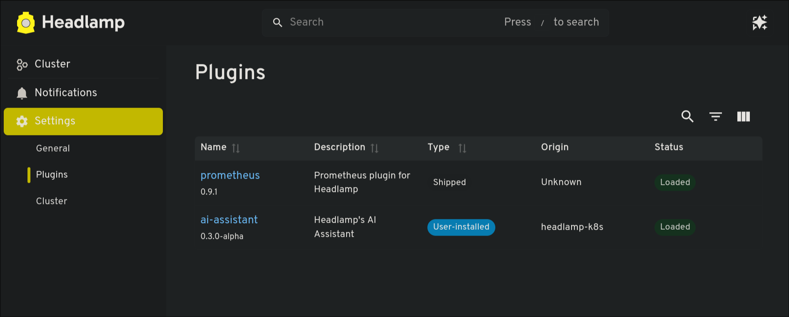
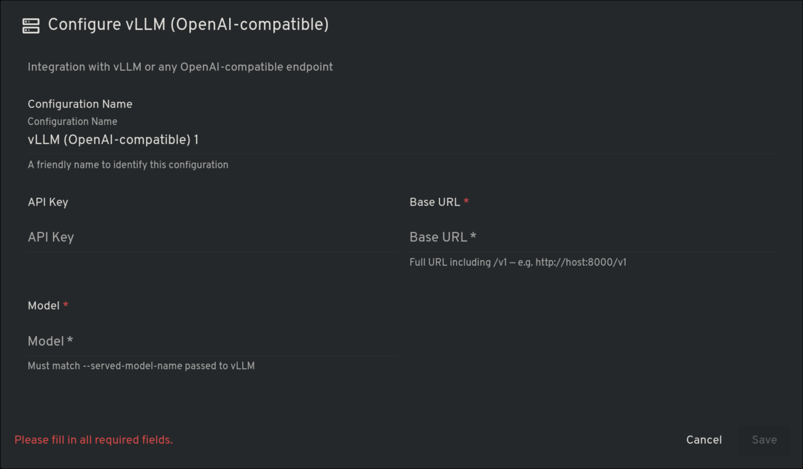
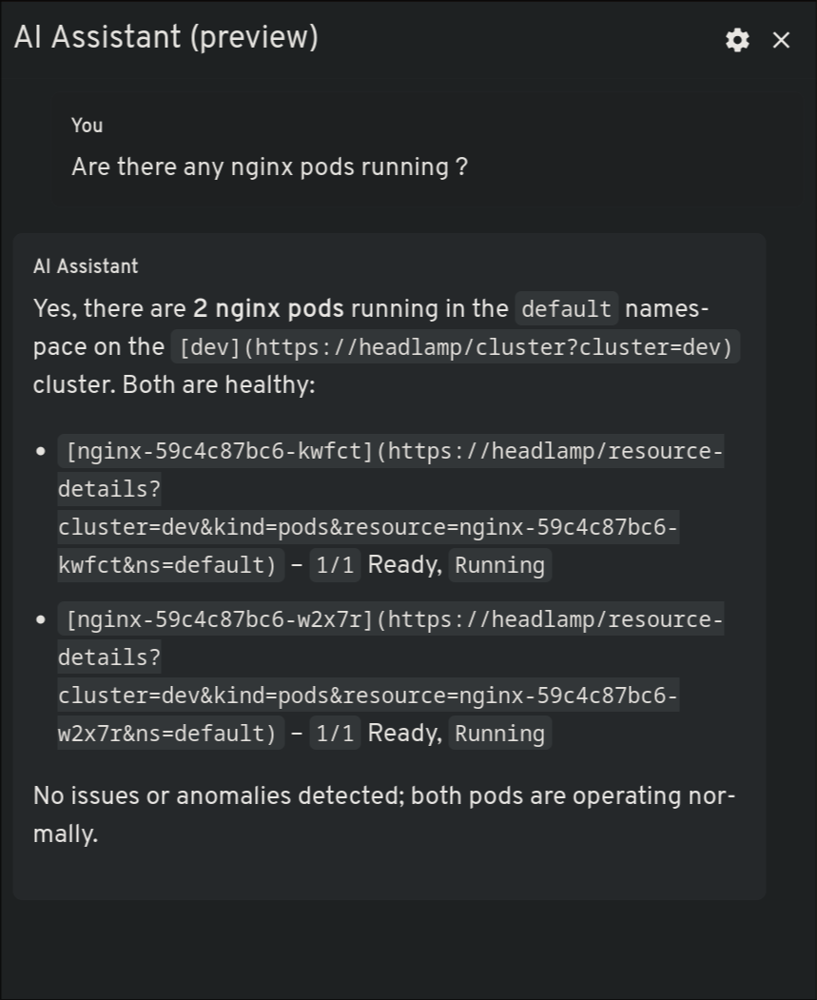

# Headlamp AI Intergration 

Run the Headlamp deployment file and under plugins we will find AI plugins select openAI compatible and add key and model and it will work

In order to access Headlamp in browser run 

```bash
kubectl port-forward -n kube-system svc/headlamp 8081:80
``` 

Then proceed to login via this command 

```bash
kubectl create token headlamp-admin -n kube-system                                                            ─╯
```

Then proceed to open plugins via head lamp UI 


Once thats done click on the assistant and add details 




Finally check via the AI message panel 




